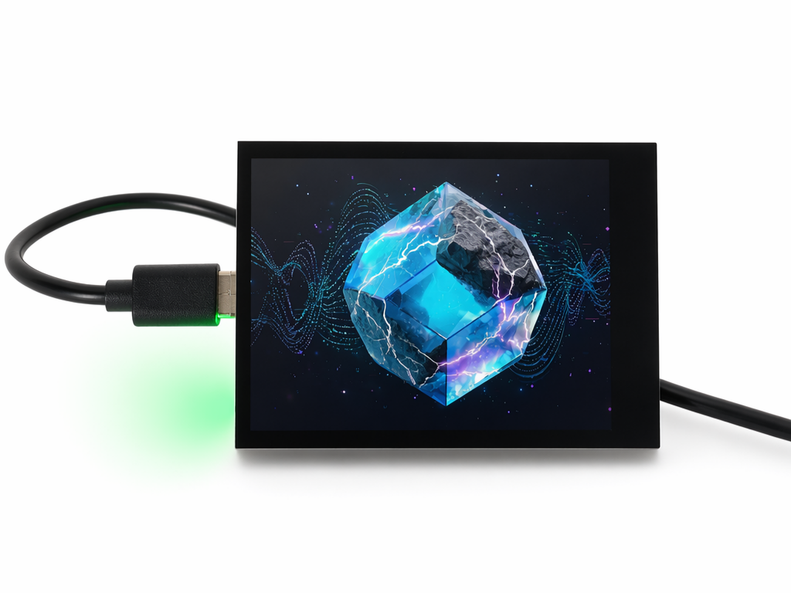
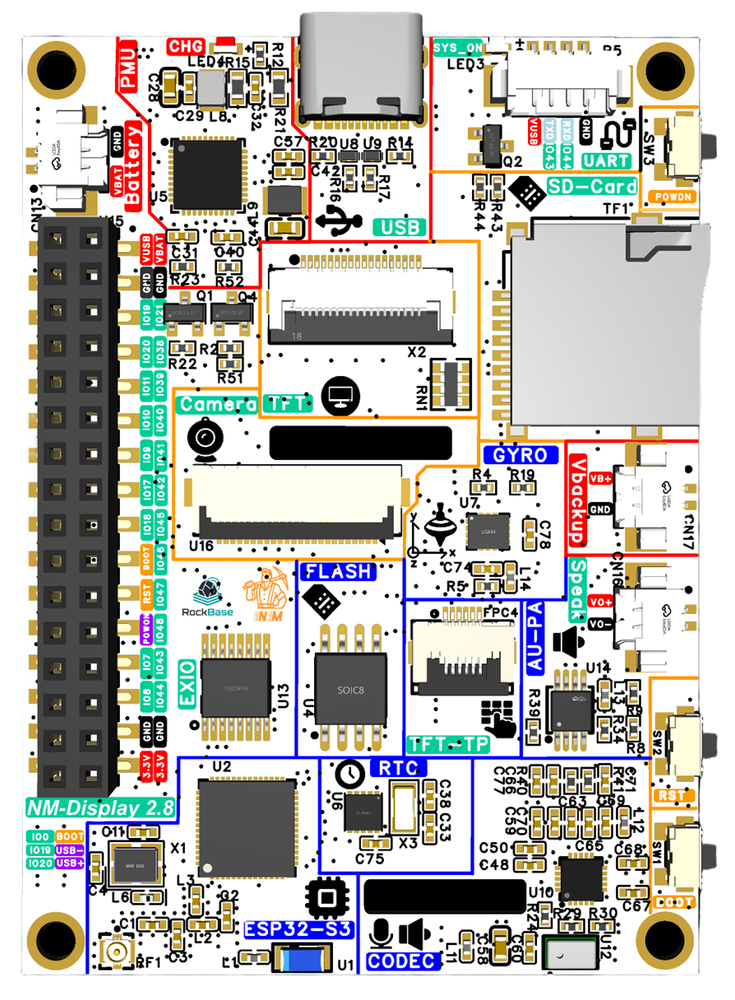
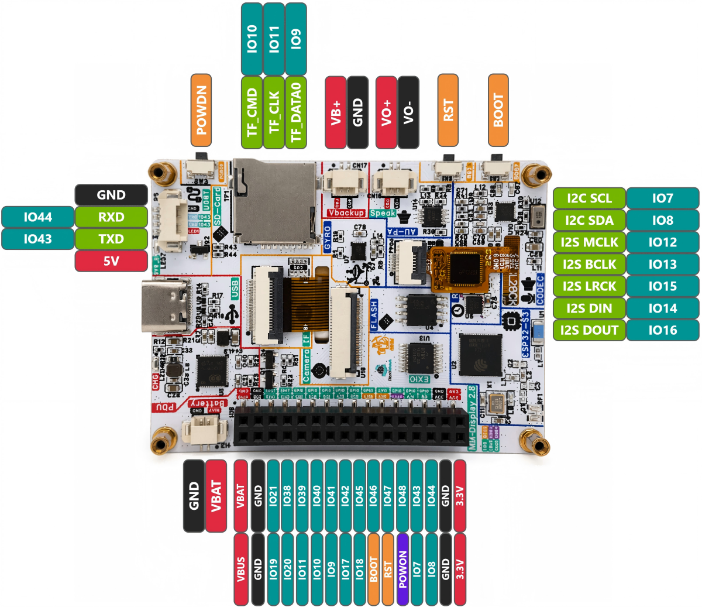

**[中文](readme_cn.md) | English**

# NM-Display-2.8inch Full Hardware Validation Firmware

This project is a full-board hardware validation firmware for the **NM-Display 2.8-inch development board** (ESP32-S3), designed for factory testing and hardware bring-up verification.

## About NM-Display-28inch

**NM-Display-28inch** is a 2.8-inch smart display development board based on the ESP32-S3, jointly created by RockBase-iot and the NMTech Team. Built upon the proven hardware foundation of the Waveshare ESP32-S3-Touch-LCD-2.8B, it introduces deep feature expansion and optimization, delivering a higher-integration development platform for smart home, IoT HMI, voice interaction terminals, and beyond.



---

## Table of Contents

- [Hardware Overview](#hardware-overview)
- [Pin Diagram](#pin-diagram)
- [IO Pin Assignment](#io-pin-assignment)
- [Dependencies](#dependencies)
- [Project Structure](#project-structure)
- [Boot Flow](#boot-flow)
- [UI Overview](#ui-overview)
- [Porting Guide](#porting-guide)

---

## Hardware Overview

| Item        | Specification                          |
| ----------- | -------------------------------------- |
| MCU         | ESP32-S3 Dual-core Xtensa LX7, 240MHz  |
| Display     | 2.8" ST7789, 320×240                   |
| Touch       | FT6336 (I2C capacitive touch)          |
| PMU         | AXP2101 (power management)             |
| Audio Codec | ES8311 (I2S audio codec)               |
| IMU         | QMI8658 (6-axis accel/gyro)            |
| RTC         | PCF85063 (real-time clock)             |
| IO Expander | TCA9554 (I2C GPIO expander)            |
| Camera      | DVP interface (OV series)              |
| SD Card     | SDMMC 1-bit mode                       |
| Wi-Fi       | ESP32-S3 built-in                      |
| Backlight   | LEDC PWM dimming                       |

---

## Pin Diagram





---

## IO Pin Assignment

### I2C Bus (Shared)

| GPIO | Function |
| ---- | -------- |
| IO7  | I2C SCL  |
| IO8  | I2C SDA  |

> All of the following peripherals share a single I2C bus (I2C_NUM_0): TCA9554, FT6336, AXP2101, ES8311 (control), QMI8658, PCF85063.

---

### LCD Display (ST7789, SPI2)

| GPIO | Function          |
| ---- | ----------------- |
| IO1  | SPI MOSI          |
| IO5  | SPI SCLK          |
| IO3  | LCD DC            |
| IO6  | Backlight BL (PWM)|
| NC   | SPI CS            |
| NC   | LCD RESET         |

- Interface: SPI, clock 80 MHz, SPI Mode 3
- Driver: ST7789
- Resolution: 320×240 (logical width×height at 270° rotation)

---

### Touch Panel (FT6336, I2C)

| GPIO | Function |
| ---- | -------- |
| IO7  | I2C SCL  |
| IO8  | I2C SDA  |
| NC   | TP INT   |
| NC   | TP RESET |

- Reset is controlled via TCA9554 IO expander PIN_1

---

### IO Expander (TCA9554, I2C)

| GPIO | Function                    |
| ---- | --------------------------- |
| IO7  | I2C SCL                     |
| IO8  | I2C SDA                     |
| —    | I2C address: TCA9554_ADDR_000 |

- PIN_1: LCD/Touch module reset (pulled low then high at power-on)

---

### Audio Codec (ES8311, I2C control + I2S data)

| GPIO | Function            |
| ---- | ------------------- |
| IO7  | I2C SCL (control)   |
| IO8  | I2C SDA (control)   |
| IO12 | I2S MCLK            |
| IO13 | I2S BCLK            |
| IO15 | I2S LRCK            |
| IO14 | I2S DIN (recording) |
| IO16 | I2S DOUT (playback) |

- Sample rate: 16 kHz, 16-bit, stereo
- Mode: full-duplex (record + playback)

---

### IMU (QMI8658, I2C)

| GPIO | Function |
| ---- | -------- |
| IO7  | I2C SCL  |
| IO8  | I2C SDA  |

- Accelerometer range: ±4G, ODR 1000 Hz
- Gyroscope range: ±512 DPS, ODR 1000 Hz
- I2C address: QMI8658_L_SLAVE_ADDRESS

---

### RTC (PCF85063, I2C)

| GPIO | Function |
| ---- | -------- |
| IO7  | I2C SCL  |
| IO8  | I2C SDA  |

- I2C address: PCF85063_SLAVE_ADDRESS
- On boot, if the stored year is earlier than 2025, the time is reset to 2025-01-01 12:00:00

---

### PMU (AXP2101, I2C)

| GPIO | Function |
| ---- | -------- |
| IO7  | I2C SCL  |
| IO8  | I2C SDA  |

- I2C address: 0x34
- Monitors: charging status, battery voltage, VBUS voltage, system voltage, DC/LDO rail voltages

---

### Camera (DVP Interface)

| GPIO | Function                     |
| ---- | ---------------------------- |
| IO38 | XCLK                         |
| IO17 | VSYNC                        |
| IO18 | HREF                         |
| IO41 | PCLK                         |
| IO45 | D0 (Y2)                      |
| IO47 | D1 (Y3)                      |
| IO48 | D2 (Y4)                      |
| IO46 | D3 (Y5)                      |
| IO42 | D4 (Y6)                      |
| IO40 | D5 (Y7)                      |
| IO39 | D6 (Y8)                      |
| IO21 | D7 (Y9)                      |
| IO8  | SCCB SDA (shared I2C bus)    |
| IO7  | SCCB SCL (shared I2C bus)    |

- XCLK frequency: 20 MHz
- Frame format: RGB565, 320×480

---

### SD Card (SDMMC 1-bit)

| GPIO | Function   |
| ---- | ---------- |
| IO9  | SDMMC D0   |
| IO10 | SDMMC CMD  |
| IO11 | SDMMC CLK  |

- Mount point: `/sdcard`
- Mode: 1-bit SDMMC

---

### Button

| GPIO | Function                   |
| ---- | -------------------------- |
| IO0  | BOOT button (active low)   |

---

## Dependencies

| Tool / Framework         | Version                                      |
| ------------------------ | -------------------------------------------- |
| ESP-IDF                  | v5.4.3 (recommended)                         |
| LVGL                     | v8.x (via managed_components)                |
| esp-lvgl-port            | Espressif official component                 |
| esp_io_expander_tca9554  | Espressif official component                 |
| esp_lcd_touch (FT6336)   | Espressif official component                 |
| iot_button               | Espressif official component                 |
| esp_codec_dev            | Espressif official component                 |
| XPowersLib               | Local components directory                   |
| sensorlib                | Local components directory (QMI8658, PCF85063)|
| esp32-camera             | Local components directory                   |

### Set up ESP-IDF environment

```bash
# Windows (PowerShell)
. $env:IDF_PATH\export.ps1

# Linux / macOS
. $IDF_PATH/export.sh
```

---

## Project Structure

```
NM-Display-28inch/
├── main/
│   ├── main.cpp                      # Entry point: hardware init sequence + touch test
│   └── Kconfig.projbuild             # menuconfig options (PMU type, etc.)
├── components/
│   ├── esp_port/                     # Peripheral driver wrappers
│   │   ├── esp_3inch5_lcd_port.cpp   # LCD SPI + backlight PWM
│   │   ├── esp_axp2101_port.cpp      # PMU
│   │   ├── esp_camera_port.cpp       # Camera
│   │   ├── esp_es8311_port.cpp       # Audio codec
│   │   ├── esp_pcf85063_port.cpp     # RTC
│   │   ├── esp_qmi8658_port.cpp      # IMU
│   │   ├── esp_sdcard_port.cpp       # SD card
│   │   └── esp_wifi_port.cpp         # Wi-Fi
│   ├── lvgl_ui/                      # LVGL main UI
│   │   └── tileview/                 # Individual feature test tile pages
│   ├── esp_lcd_st7789/               # ST7789 driver
│   ├── esp_lcd_st7796/               # ST7796 driver (alternative)
│   ├── esp_lcd_touch_ft6336/         # FT6336 touch driver
│   ├── esp32-camera/                 # ESP32 camera driver
│   ├── XPowersLib/                   # AXP2101 PMU library
│   └── sensorlib/                    # QMI8658, PCF85063 sensor libraries
├── managed_components/               # Components managed by idf_component_manager
├── partitions.csv                    # Custom partition table
├── sdkconfig.defaults                # Default config (PSRAM, Flash, etc.)
└── CMakeLists.txt
```

---

## Boot Flow

`app_main` executes the following sequence on power-on:

```
1. NVS Flash init
        ↓
2. I2C bus init (IO7/IO8, I2C_NUM_0)
        ↓
3. TCA9554 IO expander init
   └─ PIN_1 low → delay 100ms → PIN_1 high  (reset LCD/Touch module)
        ↓
4. LCD init (ST7789, SPI2, 80 MHz)
        ↓
5. Touch init (FT6336, I2C)
        ↓
6. PMU init (AXP2101, I2C addr 0x34)
        ↓
7. Audio codec init (ES8311, I2S + I2C)
        ↓
8. IMU init (QMI8658, I2C)
   └─ Self-test accelerometer and gyroscope
        ↓
9. RTC init (PCF85063, I2C)
   └─ Reset to 2025-01-01 12:00:00 if stored time is invalid
        ↓
10. SD card init (SDMMC 1-bit, mount at /sdcard)
        ↓
11. Camera init (DVP, RGB565, 320×480)
        ↓
12. Wi-Fi init (Station mode, connect to configured AP)
        ↓
13. Backlight init, set brightness to 80%
        ↓
14. LVGL port init (register LCD + touch devices)
        ↓
15. Button init (IO0, BOOT key, single-click exits touch test)
        ↓
16. Touch test mode
    ├─ Display prompt text on screen
    ├─ Poll touch coordinates in a loop, draw red square at touch point
    └─ Press BOOT button to exit touch test
        ↓
17. Launch LVGL UI (multi-page TileView)
```

---

## UI Overview

The LVGL UI uses a horizontally scrollable **TileView** with 6 pages. Swipe left/right to switch between them.

| Page | Name        | Description                                                                                           |
| ---- | ----------- | ----------------------------------------------------------------------------------------------------- |
| 0    | RGB Test    | Screen background cycles through red / green / blue every second — verifies LCD color output         |
| 1    | System Info | Shows Flash size, PSRAM size, chip temperature, CPU frequency, SD card capacity, RTC date/time; backlight brightness slider; ES8311 audio record/playback test button |
| 2    | AXP2101     | Live PMU status: charging state, battery connection, VBUS input, battery/VBUS/system voltage, DC/LDO rail voltages |
| 3    | QMI8658     | Live IMU data: 3-axis accelerometer (mg), 3-axis gyroscope (dps), IMU temperature                    |
| 4    | Camera      | Live camera preview (RGB565, 320×480), frames rendered via LVGL image widget                          |
| 5    | Wi-Fi       | Shows current IP address; Wi-Fi enable/disable switch and Scan button to list nearby APs              |

---
---

## Porting Guide

### 1. Change Wi-Fi credentials

Edit `main/main.cpp`:

```cpp
esp_wifi_port_init("YOUR_SSID", "YOUR_PASSWORD");
```

### 2. Change display rotation

Edit the macro at the top of `main/main.cpp`:

```cpp
#define EXAMPLE_DISPLAY_ROTATION 270  // Options: 0 / 90 / 180 / 270
```

`lv_port_init()` already has swap_xy / mirror_x / mirror_y pre-configured for all four orientations — no further changes needed.

### 3. Adapt to a different board

| What to change        | File                                          |
| --------------------- | --------------------------------------------- |
| LCD pins / driver     | `components/esp_port/esp_3inch5_lcd_port.cpp` |
| Touch pins / driver   | `components/esp_port/esp_3inch5_lcd_port.cpp` |
| Camera pins           | `components/esp_port/esp_camera_port.cpp`     |
| SD card pins          | `components/esp_port/esp_sdcard_port.cpp`     |
| Audio I2S pins        | `components/esp_port/esp_es8311_port.cpp`     |
| I2C pins              | `main/main.cpp` (`EXAMPLE_PIN_I2C_SDA/SCL`)  |

### 4. Build and flash

```bash
# Optional: open menuconfig (change PMU type, etc.)
idf.py menuconfig

# Build
idf.py build

# Flash and open serial monitor (replace COM3 with your port)
idf.py -p COM3 flash monitor
```

### 5. Partition table

The project uses a custom `partitions.csv` with pre-allocated NVS and OTA partitions. It is applied automatically during flash.

---

## Notes

- **AXP2101 Chip ID**: This board reports Chip ID `0x47` instead of the standard `0x4A`. The override is handled in `esp_axp2101_port.cpp` via a macro — no user action required.
- **Touch test**: The touch test screen is shown immediately after boot. Press the **BOOT button** to exit and proceed to the main UI.
- **Camera**: The camera preview page runs in a dedicated FreeRTOS task. A 10 ms timeout LVGL lock is used when updating the image widget to avoid blocking the UI thread.
- **SD card**: A failed SD card mount does not block the boot sequence. If the system info page shows 0 capacity, the card is not mounted or not inserted.
